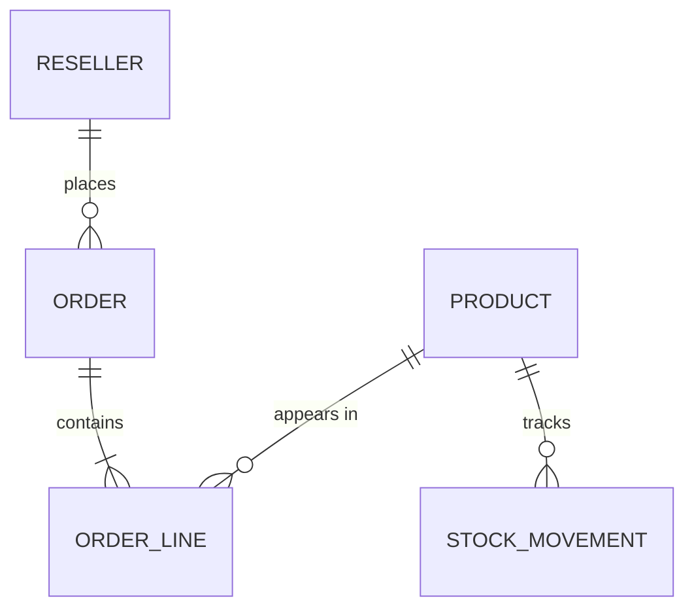

# Design Document: Reseller Order API

## 1. Overview 
A REST API for managing products, resellers, orders and stock levels for a maker-tools distributor. Resellers place orders, sales staff confirm and ship them, and stock is kept accurate at all times. 

## 2. Entities

**Product**: ProductId, VariationId, Name, Category, NetPrice, StockQuantity, IsActive, RowVersion

**Reseller** ResellerId, Name, Email, Country, Class

**Order** OrderId, ResellerId, Status, CreatedAt

**OrderLine** OrderLineId, OrderId, ProductId, Quantity, UnitPrice

**StockMovement** StockMovementId, ProductId, Change, Reason, CreatedAt

## 3. ER Diagram

## 4. Order Lifecycle 
- Pending → Confirmed or Cancelled 
- Confirmed → Shipped or Cancelled 
- Shipped → Delivered 
- Delivered and Cancelled are final 

Any other transition is rejected. 

## 5. Business Rules
1. An order must have at least one line, and every quantity must be above 0.
2. Only active products can be used in new orders. 
3. Confirming an order checks that stock is sufficient for every line. If any line fails the whole order fails and no stock changes. 
4. Confirming reduces stock and creates a StockMovement per line. 
5. Cancelling a Confirmed order restores the stock. Cancelling a Pending order doesn't touch stock. 
6. Shipped and Delivered orders can't be edited or cancelled. 
7. Total = sum of quantity per line, rounded to 2 decimals. 
8. Stock can never go below 0, even if two orders are confirmed at the same time.

## 6. API Endpoints

| Resource | Endpoints |
|---|---|
| Products | GET /products, GET /products/{id}, POST /products, PUT /products/{id}, DELETE /products/{id} |
| Resellers | Same five endpoints under /resellers |
| Orders | POST /orders, GET /orders/{id}, GET /orders, POST /orders/{id}/confirm, /ship, /deliver, /cancel |
| Stock | POST /products/{id}/restock, GET /products/{id}/stock-history |